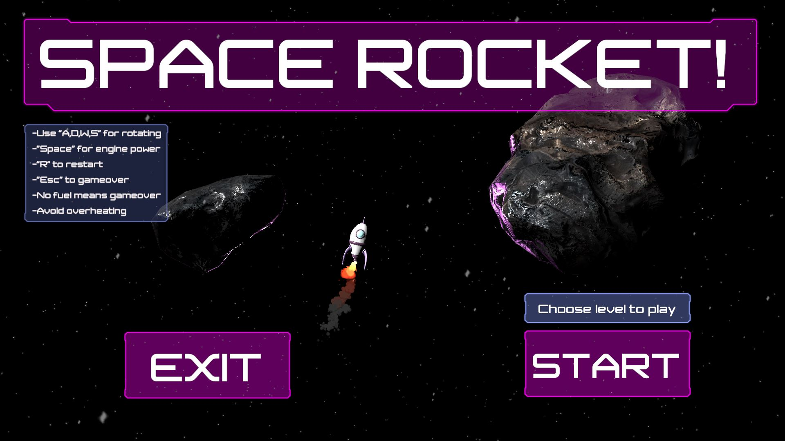
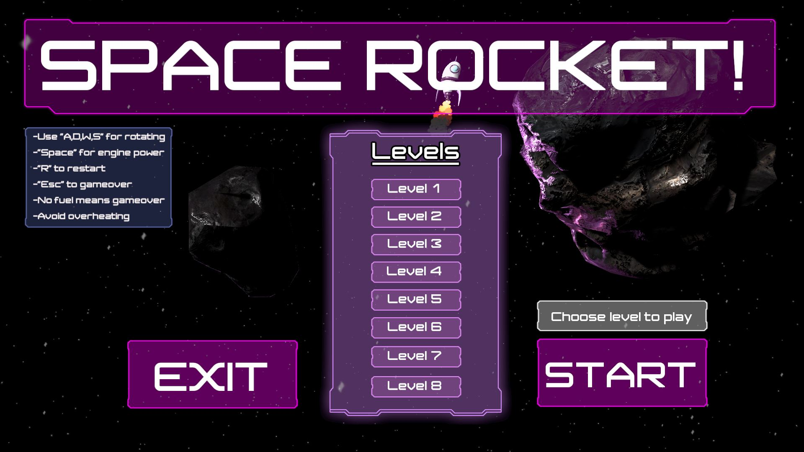
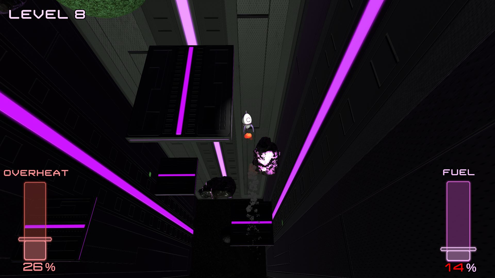
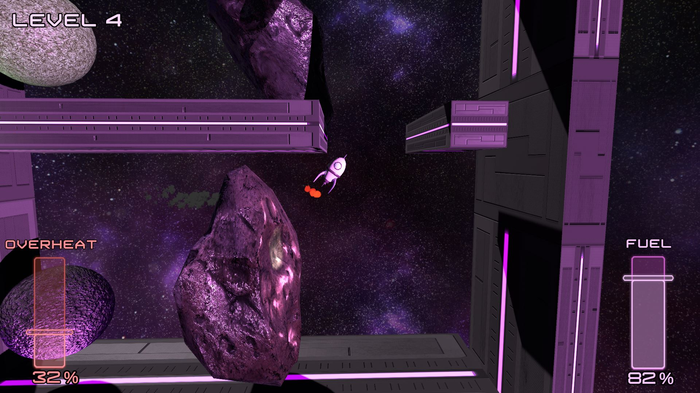
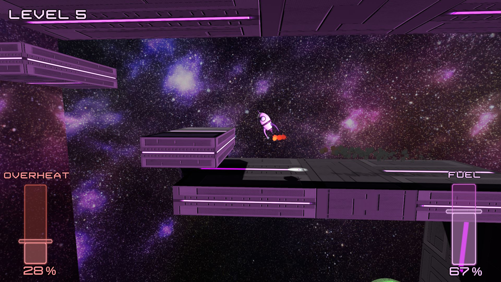
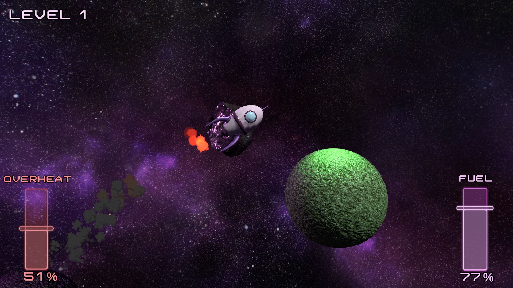
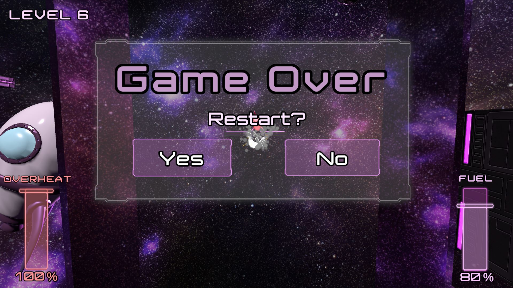
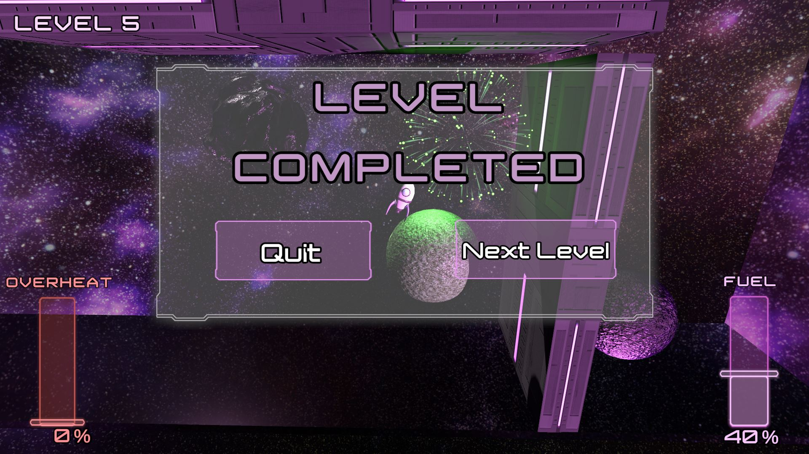

# SpaceRocketGame-Unity3D
Gameplay video: https://youtu.be/Y1sU86U8CqM  
https://btuhan.itch.io/space-rocket  
Purpose is to reach the other planet while avoiding moving obstacles (asteroids and walls) also keeping the fuel level above zero.  
- There are 8 levels. 
- Gameover if player hits obstacles or rocket's fuel go below zero.
- Player rocket can move in 3D except three levels designed for 2D (X-Y) movement.
- There is a mechanic called "*Overheat*". If the player keeps the engine running for a long time, the overheat state begins in that case player can not force up the rocket. In the UI, the player can check overheat level.
- To make player stay in the boundary limits, I added a script that checks the player position. If player goes out the limits, fuel starts to decrease with a faster speed until the player comes the boundary limits.

## Menu

## Levels
       
## In-game
   

